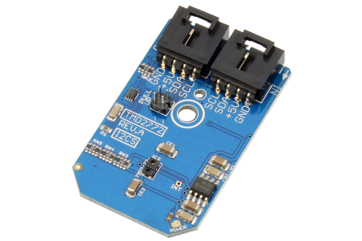

[](https://www.controleverything.com/content/Light?sku=TMD2772_I2CS)
# TMD2772
TMD2772 Proximity and Ambient Light Sensor

The TMD2772 is a fully integrated proximity and ambient light sensor.

This Device is available from ControlEverything.com [SKU: TMD2772_I2CS]

https://www.controleverything.com/content/Light?sku=TMD2772_I2CS

This Sample code can be used with Raspberry pi, Arduino and Beaglebone Black.

## Java
Download and install pi4j library on Raspberry pi. Steps to install pi4j are provided at:

http://pi4j.com/install.html

Download (or git pull) the code in pi.

Compile the java program.
```cpp
$> pi4j TMD2772.java
```

Run the java program.
```cpp
$> pi4j TMD2772
```

## Python
Download and install smbus library on Raspberry pi. Steps to install smbus are provided at:

https://pypi.python.org/pypi/smbus-cffi/0.5.1

Download (or git pull) the code in pi. Run the program.

```cpp
$> python TMD2772.py
```

## Arduino
Download and install Arduino Software (IDE) on your machine. Steps to install Arduino are provided at:

https://www.arduino.cc/en/Main/Software

Download (or git pull) the code and double click the file to run the program.

Compile and upload the code on Arduino IDE and see the output on Serial Monitor.

## C

Download (or git pull) the code in Beaglebone Black.

Compile the c program.
```cpp
$>gcc TMD2772.c -o TMD2772
```
Run the c program.
```cpp
$>./TMD2772
```
#####The code output is the proximity and lux value of ambient light.
